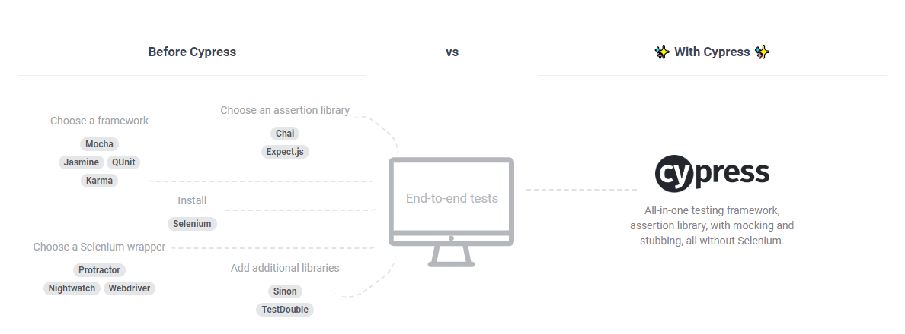

> 本文為 Cypress 的使用筆記，紀錄如何安裝 Cypress 。

## 介紹

Cypress 是個 E2E 的測試框架，可以寫測試腳本模擬使用者操作 Web 系統的行為來測試系統是否反應正常。

### 與之前的測試方式做比較



在 Cypress 之前，要做 E2E 測試會需要使用多個不同的工具做集成，但 Cypress 已經將所有 E2E 測試需要的工具包在一起了，因此使用 Cypress 時不用自己設置這些工具的設定，只要載入 Cypress 然後使用就好。

## 安裝

安裝 Cypress 直接使用 npm 即可:

```bash
npm install cypress --save-dev
```

執行完成後我們就把 Cypress 安裝完成了。

接著將開啟 Cypress 的指令加到 package.json 的 scripts 中:

```js
{
  "scripts": {
    ...
    "cypress:open": "cypress open"
  },
  ...
}
```

如此一來執行 `npm run cypress:open` 就可以開啟 Cypress 的 Test Runner 了。

## 取得 ESLint 支援

使用 ESLint 可以幫助開發時減少錯誤發生。

### 安裝 ESLint plugin

```bash
npm install eslint-plugin-cypress --save-dev
```

### 設置 .eslintrc.js

在設定檔上加上 Cypress Plugin 相關的設定:

```js
{
  "plugins": [
    "cypress"
  ],
  "extends": [
    "plugin:cypress/recommended"
  ],
  "env": {
    "cypress/globals": true
  }
}
```

## 檔案說明

在安裝完 Cypress 後會在專案跟路徑中出現一個 cypress 的資料夾已經 cypress.json 的檔案:


```bash
.
|-cypress
| |-fixtures        # 測試使用的靜態資料
| |-integration     # 測試腳本
| |-plugins         # 插件
| |-support         # 擴充或客製的指令
|-cypress.json      # 全域及環境變數
```

## Test Runner

使用 `npm run cypress:open` 開啟 Test Runner 後會看到下面的畫面:


這些檔案會是 cypress 資料夾中的 integration 資料夾裡的檔案，可以使用資料夾將相關的資料做分類。

按下想要測試的檔案後就會開始執行測試。

## 除錯

Cypress 會對測試中的每一個動作做紀錄，我們可以在測試結束時去看這些紀錄，如果有錯誤的話也可以去看是錯在哪個地方，接下來使用 [cypress-example-kitchensink](https://github.com/cypress-io/cypress-example-kitchensink) 來示範如何使用 Cypress 來除錯。


上圖是執行測試時的畫面， Cypress 會將每個步驟都記錄起來，在執行完後可以按下其中一個選取元素，會如下圖:


在右邊的畫面上會選到對應的元素。

### 截圖

當你選到動作時，像是輸入字串或是按下按鈕， Cypress 會幫我們紀錄動作前後的截圖，我們可以用畫面下方的 before 及 after 去切換:


### Console

在 Console 中會顯示被釘選的元素的詳細資料:


## 結語

本文簡單講述 Cypress 的安裝及使用方式，之後會介紹如何使用 Cypress 撰寫測試。

## 參考資料

* [cypress.io](https://www.cypress.io/)
* [cypress-example-kitchensink](https://github.com/cypress-io/cypress-example-kitchensink)
* [eslint-plugin-cypress](https://github.com/cypress-io/eslint-plugin-cypress)