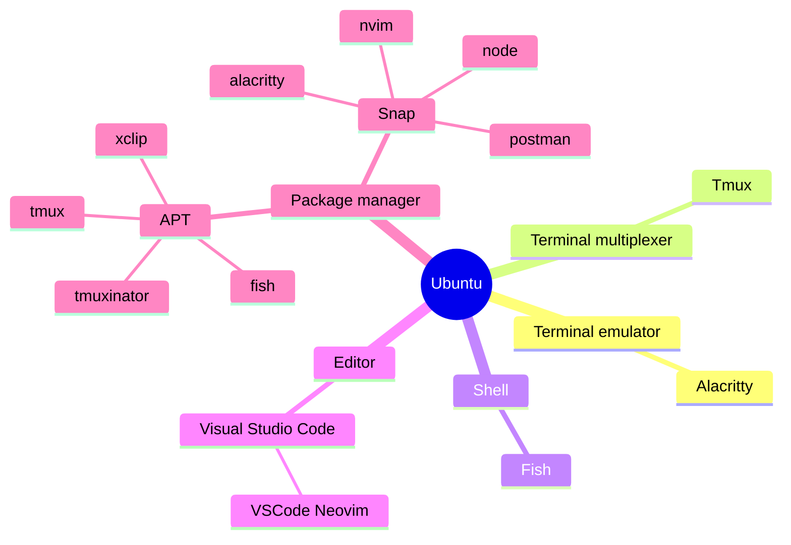

# Ubuntu

這個環境是在公司內部使用的，由於安全性的考量，內部的環境不能隨意的下載、安裝各式工具，因此這個配置會在盡可能減少工具的數量並簡化安裝步驟的情況下來設置開發環境，並且盡量不要與其他的環境在生產力上有太大的差別。

# 工具清單

- Terminal emulator
  - Alacritty
- Terminal multiplexer
  - Tmux
- Shell
  - Fish
- Editor
  - Visual Studio Code
    - VSCode Neovim
